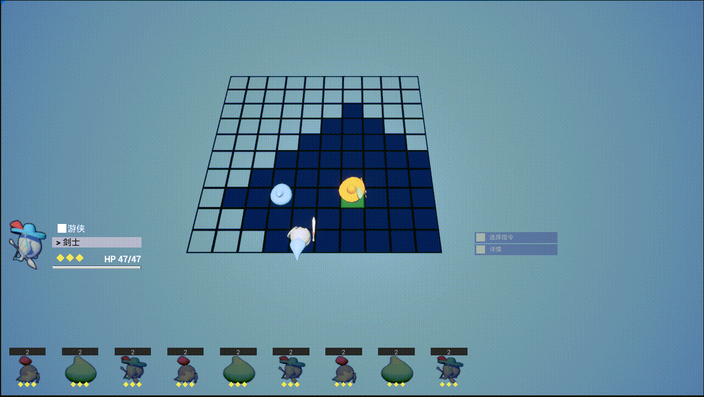
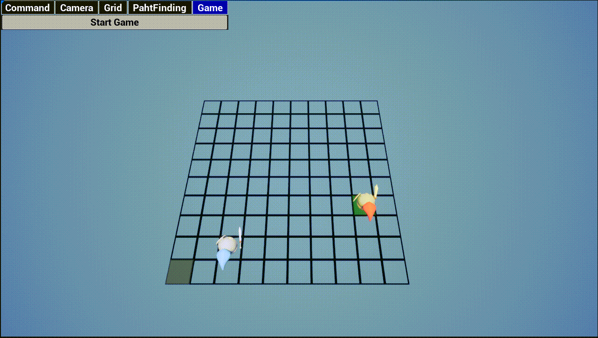
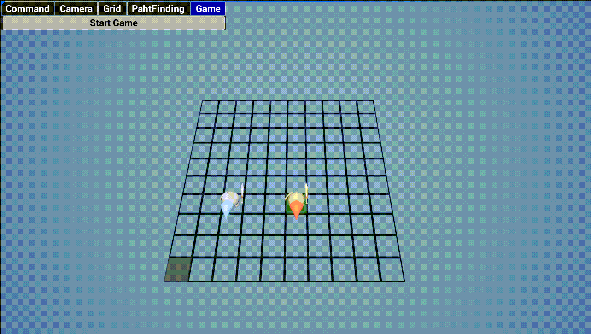
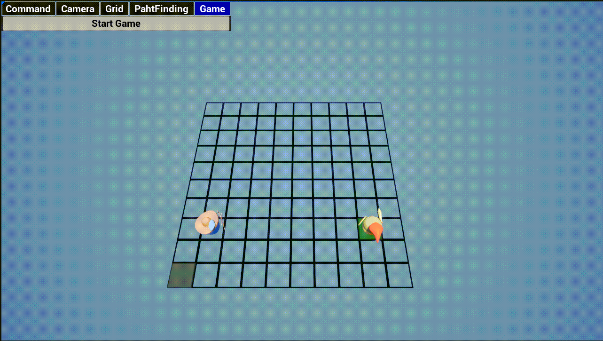
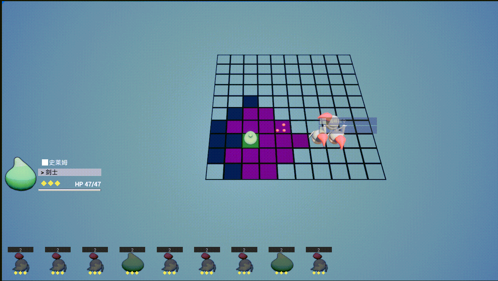
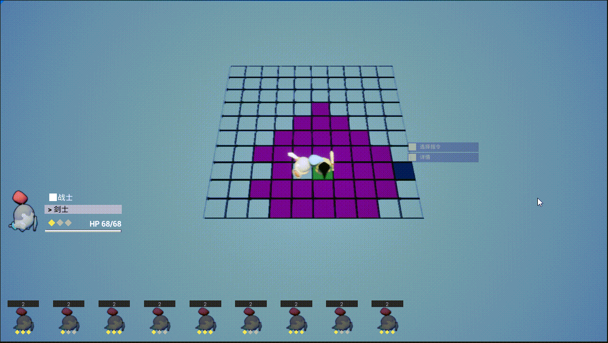
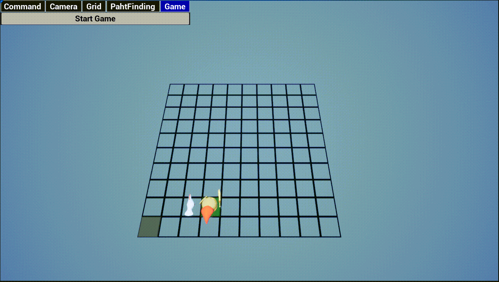
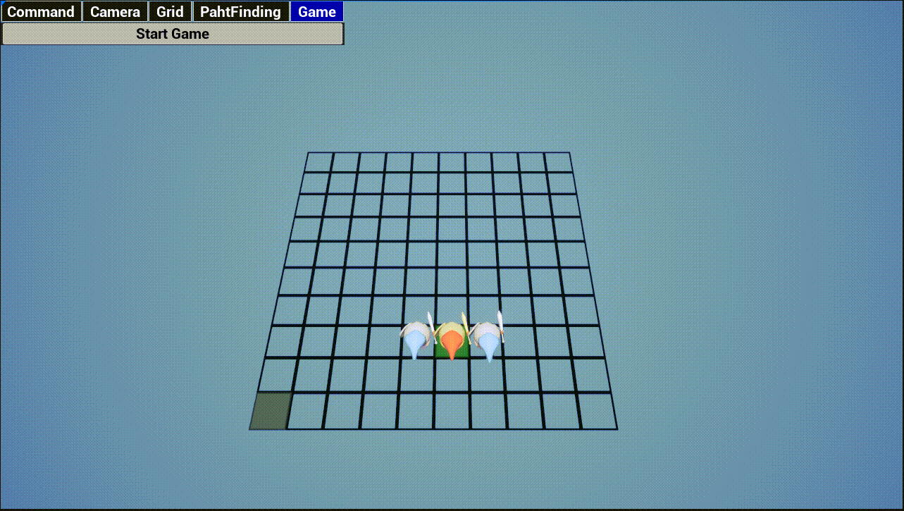

### 転職のために　開発している試用品です
#### 今実装した機能以下です
1. マップ編集
2. カメラ移動と回り
3. 移動範囲表示
4. パス検索
5. コマンド入力、取り消し
6. キャラの状態
7. 戦闘内UI
8. 普通攻撃スキルのロジックと演出
9. 治療スキルのロジックと演出
10. バック攻撃判定
11. 連携攻撃のロジックと演出
12. アーチャー攻撃ロジックと出演

参考GIF
1. マップ編集

2. パス検索と移動範囲表示

3. 敵の移動範囲と攻撃範囲表示

4. 命令を入力したり取り消したり

5. 普通攻撃

6. アーチャー攻撃

7. 魔法範囲攻撃

8. 投げ出す

9. 撃退

10. 連携攻撃

